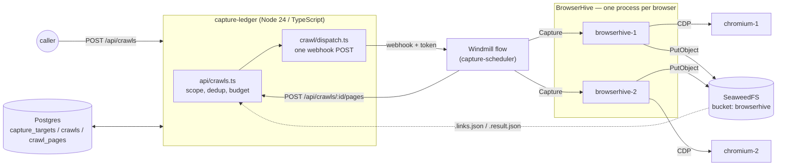

## Stage 0 — where the project is today

## From submission to outcome

**capture-ledger does not speak gRPC to BrowserHive any more.** The Windmill flow
calls `Capture`, waits for the answer, and reports; capture-ledger plans the next
level and records what happened. There is no BrowserHive address in capture-ledger's
configuration at all. Each BrowserHive drives one browser and runs one capture at
a time — a busy one refuses with `RESOURCE_EXHAUSTED` — so picking a free endpoint
is the flow's job too.

One level is one round trip. The flow captures the URLs it was handed and posts
`POST /api/crawls/:id/pages` with a `taskId` and a status per page. capture-ledger writes
`crawl_pages`, attributes the submissions, filters the discovered links, applies
the budget, and answers with the next level — or with a `stopReason`.

The level report does **not** carry artifact locations, so capture-ledger re-reads the
`{taskId}_{correlationId}[_{labels}].result.json` manifest BrowserHive writes
next to the artifacts. That file survives a BrowserHive restart, which is what
makes it usable here.

Consequences worth knowing:

- **A page reported `failed` may still have produced an archive.** If the result
  aged out of BrowserHive's cache while the flow was waiting, the flow sees
  `NOT_FOUND` and reports a failure — but the manifest is in the bucket, so
  capture-ledger admits it anyway and corrects the `crawl_pages` row.
- A manifest that is not there yet is skipped rather than raised. Throwing would
  turn a late write into a 500 on the level report, stopping the crawl; the
  reconciler picks it up instead.
- `capture_submissions` is written for **every** page that carried a `taskId`,
  not only the successful ones — attribution is what the reconciler later needs.

## The ledger and authorization

The diagram above stops at **submitting**. Once a capture finishes, capture-ledger puts
the result in the ledger and hands out signed URLs only to those allowed to read
it. That is where OpenFGA comes in.

How to read it:

- **`archives` and `fga_outbox` are written in one transaction.** No transaction
  spans Postgres and OpenFGA, so the tuple goes into the same box as an intent to
  send, and `outbox-worker` retries until OpenFGA accepts it.
- **OpenFGA has a Postgres of its own.** Not sharing capture-ledger's makes the boundary
  visible: a tuple write cannot join the application transaction — which is
  exactly why the outbox exists.
- **Membership is not stored.** Which organizations a caller belongs to arrives
  from their token and is passed as a contextual tuple on every Check.
- Two paths lead into the ledger: a **crawl** admitting what a level captured
  (fast, `src/crawl/admit-level.ts`), and `reconcile` sweeping the bucket (picks
  up whatever landed while capture-ledger was down). Both go through `admitArchive`, and
  `(bucket, object_key)` is unique, so reaching the same capture twice is a no-op.

See [Archive ledger](/capture-ledger/archive-ledger/) for the details.

## Module layout

| Module                          | Responsibility                                                                                             |
| ------------------------------- | ---------------------------------------------------------------------------------------------------------- |
| `src/api/server.ts`             | The only entry point. Reads the capture settings once, registers the routes, drains the outbox on a timer. |
| `src/api/crawls.ts`             | Start a crawl, report a level, hand back the next one. Authorization, policy, and record-keeping.          |
| `src/crawl/`                    | Scope, budget, level admission, and the Windmill dispatch.                                                 |
| `src/config/capture-formats.ts` | `CAPTURE_LEDGER_CAPTURE_FORMATS` / `_SIGNING` → the `captureFormats` every dispatch carries.               |
| `src/data/url-source.ts`        | The one SQL query over `capture_targets`. Returns `{ url }[]` for the organization asking.                 |
| `src/archive/`                  | Manifests, admission into the ledger, and the reconciler.                                                  |
| `src/rpc/generated/`            | Types only, from the vendored `.proto` — the manifest is a `CaptureResultReport`. Never edited by hand.    |
| `src/db/`                       | Pool, Kysely wiring, migrations, seeds.                                                                    |

## Error handling

Telling a rejection apart from an outage is the flow's job now — it is the side
holding the gRPC channel. capture-ledger's half is what happens to the `crawls` row.

A dispatch that cannot be delivered closes the row as `failed` with the message
on it. **It is never left `running`**: the partial unique index means an unclosed
row blocks every later crawl, and nothing in the row distinguishes a live crawl
from an abandoned one.

Unexpected failures on the API surface as a bare `500 { "error": "internal
error" }`. Fastify's default would return `err.message` and `err.code`, and
Postgres puts column types and mangled values in there — a client-side mistake
would become a window onto the server's internals. 4xx bodies pass through
unchanged: those are written for the caller.

## Network layout

The stack runs on Apple Container. The project name is the DNS domain, so every
service is `<service>.capture-ledger` — resolvable between containers **and from the
host**, which is why capture-ledger itself needs no container.

| Service        | DNS name                       | Container port     | Host port         |
| -------------- | ------------------------------ | ------------------ | ----------------- |
| postgres       | `postgres.capture-ledger`      | 5432               | 5432              |
| seaweedfs      | `seaweedfs.capture-ledger`     | 8333 / 8888 / 9333 | — (internal only) |
| chromium-1     | `chromium-1.capture-ledger`    | 9222 (CDP)         | 9222              |
| chromium-2     | `chromium-2.capture-ledger`    | 9222 (CDP)         | 9223              |
| browserhive-1  | `browserhive-1.capture-ledger` | 50051 (gRPC)       | 50051             |
| browserhive-2  | `browserhive-2.capture-ledger` | 50051 (gRPC)       | 50052             |
| capture-ledger | — (runs on the host)           | —                  | —                 |

There is one compose file. The one-shot migrate/seed jobs are not services:
`scripts/prod-smoke.sh` invokes them with `container run --rm`, because
container-compose has no `run` subcommand. The image's `ENTRYPOINT` is
`node dist/api/server.js`, so those jobs override it.

Bucket creation is **not** a separate service. BrowserHive's SeaweedFS entrypoint
spawns its `init-bucket.sh` alongside `weed server`, and its retry loop does the
waiting. `browserhive` is given `WAIT_FOR_S3`; its entrypoint polls that URL
until the S3 listener answers before starting the server, because the boot
`HeadBucket` is fatal and `depends_on` orders starts only.

## Upstream pinning

capture-ledger tracks a fixed BrowserHive version through one submodule pointer — see
[Upgrading BrowserHive](/capture-ledger/upgrading-browserhive/), which reads the current
value out of the repository rather than restating it.
