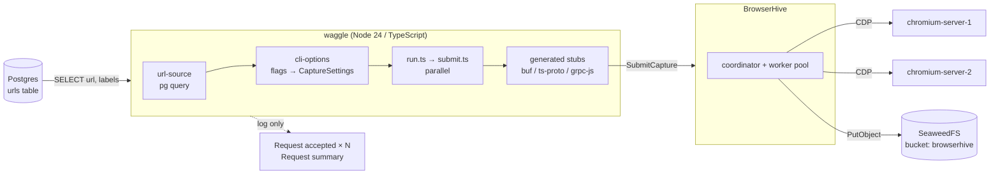
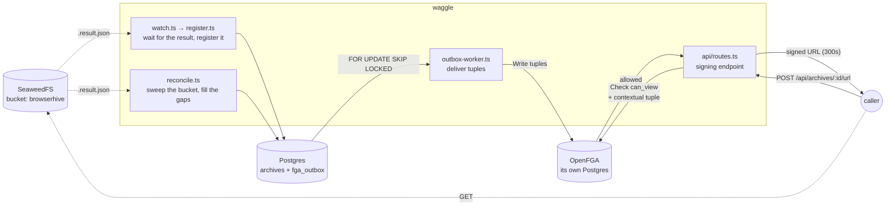

## Stage 0 — where the project is today

## From submission to outcome

`SubmitCapture` returns a `taskId` as soon as the request is queued, and the
capture runs asynchronously.

The outcome is collected afterwards through `GetCapture`, whose `state` says
`PENDING` / `PROCESSING` while a task is in flight and `DONE` once it finished,
carrying the status and every artifact location. The same report is also written
to the bucket as `{taskId}_{correlationId}[_{labels}].result.json`, which survives a
BrowserHive restart — and is what `waitForCapture` falls back to when the
in-memory result has already been evicted.

Consequences worth knowing:

- A `Request summary` of `accepted: 3` means three tasks were **queued**, not
  that three captures succeeded.
- A submission that is accepted can still fail its capture. That outcome
  reaches the ledger through `GetCapture`, or later through the reconciler —
  never through the summary line.
- `correlationId` (8 hex characters, generated per submission) is the thread
  between a waggle log line and the artifact filename.

## The ledger and authorization

The diagram above stops at **submitting**. Once a capture finishes, waggle puts
the result in the ledger and hands out signed URLs only to those allowed to read
it. That is where OpenFGA comes in.

How to read it:

- **`archives` and `fga_outbox` are written in one transaction.** No transaction
  spans Postgres and OpenFGA, so the tuple goes into the same box as an intent to
  send, and `outbox-worker` retries until OpenFGA accepts it.
- **OpenFGA has a Postgres of its own.** Not sharing waggle's makes the boundary
  visible: a tuple write cannot join the application transaction — which is
  exactly why the outbox exists.
- **Membership is not stored.** Which organizations a caller belongs to arrives
  from their token and is passed as a contextual tuple on every Check.
- Two paths lead into the ledger: `waggle` waiting for the result (fast), and
  `reconcile` sweeping the bucket (picks up whatever landed while waggle was down).

See [Archive ledger](/waggle/archive-ledger/) for the details.

## Module layout

| Module                      | Responsibility                                                                                               |
| --------------------------- | ------------------------------------------------------------------------------------------------------------ |
| `src/submit-captures.ts`    | The `waggle` entry point. Parses flags, submits captures, exits non-zero on a fatal error.                   |
| `src/config/cli-options.ts` | Flag definitions, `ClientOptions`, and the `CaptureSettings` the request body spreads.                       |
| `src/data/url-source.ts`    | The one SQL query. Returns `{ url, labels }[]`.                                                              |
| `src/client/run.ts`         | Orchestration: load, configure, submit all, summarise.                                                       |
| `src/client/submit.ts`      | One request. Never throws — failures come back as `accepted: false`.                                         |
| `src/rpc/`                  | The gRPC channel, the promise wrappers, and `generated/` — from the vendored `.proto`, never edited by hand. |
| `src/db/`                   | Pool, Kysely wiring, migrations, seeds.                                                                      |

## Error handling

Rejected requests and unreachable servers alike surface as `accepted: false`
with a message — `submitRequest` never throws at the caller. The message prefers
the `ServiceError`'s `details` over its `message`, because the latter is the
status glued onto the front of the former: `"3 INVALID_ARGUMENT: url is empty"`
where the detail alone says `url is empty`.

`GetCapture` is the other half, and it does **not** follow that rule. Only
`NOT_FOUND` is handled — that one means "unknown task, or evicted from the
result cache", which is answered by reading the durable manifest. Every other
failure propagates, so an outage cannot be mistaken for a run in which no
capture produced anything.

## Network layout

The stack runs on Apple Container. The project name is the DNS domain, so every
service is `<service>.waggle` — resolvable between containers **and from the
host**, which is why waggle itself needs no container.

| Service     | DNS name             | Container port     | Host port         |
| ----------- | -------------------- | ------------------ | ----------------- |
| postgres    | `postgres.waggle`    | 5432               | 5432              |
| seaweedfs   | `seaweedfs.waggle`   | 8333 / 8888 / 9333 | — (internal only) |
| chromium-1  | `chromium-1.waggle`  | 9222 (CDP)         | 9222              |
| chromium-2  | `chromium-2.waggle`  | 9222 (CDP)         | 9223              |
| browserhive | `browserhive.waggle` | 50051 (gRPC)       | 50051             |
| waggle      | — (runs on the host) | —                  | —                 |

There is one compose file. The one-shot migrate/seed/capture jobs are not
services: `scripts/prod-smoke.sh` invokes them with `container run --rm`,
because container-compose has no `run` subcommand.

Bucket creation is **not** a separate service. BrowserHive's SeaweedFS entrypoint
spawns its `init-bucket.sh` alongside `weed server`, and its retry loop does the
waiting. `browserhive` is given `WAIT_FOR_S3`; its entrypoint polls that URL
until the S3 listener answers before starting the server, because the boot
`HeadBucket` is fatal and `depends_on` orders starts only.

## Upstream pinning

waggle tracks a fixed BrowserHive version through one submodule pointer — see
[Upgrading BrowserHive](/waggle/upgrading-browserhive/), which reads the current
value out of the repository rather than restating it.
