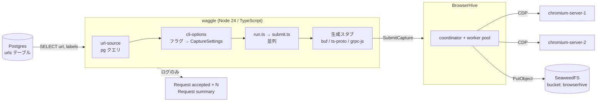
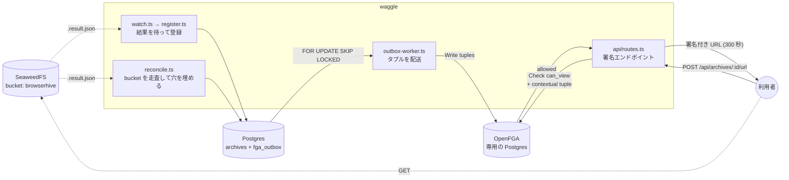

## Stage 0 — 現在の到達点

## 投げっぱなし (fire-and-forget)

`SubmitCapture` はリクエストをキューに載せた時点で `taskId` を返し、キャプチャは
非同期に走ります。

結末は後から `GetCapture` で回収します。`state` が処理中なら `PENDING` /
`PROCESSING`、完了していれば `DONE` で、成否と全成果物の場所が入っています。
同じ内容は `{taskId}_..._{labels}.result.json` としてバケットにも書かれ、
こちらは BrowserHive の再起動にも耐えます —— メモリ上の結果が既に追い出されて
いたとき `waitForCapture` が落ちる先がこれです。

知っておくべき帰結:

- `Request summary` の `accepted: 3` は 3 件が**キューに入った**という意味で、
  3 件のキャプチャが成功したという意味ではありません。
- 受理されたリクエストでも、キャプチャ自体は失敗しえます。その結末は
  `GetCapture` か、後から reconciler 経由で台帳に届きます —— サマリ行では
  ありません。
- `correlationId` (送信ごとに採番される 16 進 8 桁) が、waggle のログ行と
  成果物のファイル名を結ぶ糸です。

## 台帳と認可

上の図は**投げるところまで**です。取り込みが終わったあと、waggle は結果を台帳に
入れ、それを読んでよい相手だけに署名付き URL を配ります。ここが OpenFGA の
出番です。

読み方の要点:

- **`archives` と `fga_outbox` は 1 つのトランザクションで書かれます。**
  Postgres と OpenFGA に跨がるトランザクションが無いので、タプルは「送る予定」として
  同じ箱に入れ、`outbox-worker` が受理されるまで再送します。
- **OpenFGA は別の Postgres を持ちます。** waggle のものと共用しないのは、
  タプルの書き込みがアプリのトランザクションに入れられないこと ——
  だから outbox が要ること —— を目に見えるようにするためです。
- **所属は保存しません。** 「この人はどの組織か」はトークンから来て、Check のたびに
  contextual tuple として渡されます。
- 台帳へ入る道は 2 本あります。`waggle` が結果を待つ経路（速い）と、
  `reconcile` が bucket を走査する経路（waggle が止まっていた間の取りこぼしを拾う）。

詳しくは[アーカイブ台帳](/waggle/ja/archive-ledger/)を参照してください。

## モジュール構成

| モジュール                  | 責務                                                                                               |
| --------------------------- | -------------------------------------------------------------------------------------------------- |
| `src/submit-captures.ts`    | `waggle` の入口。旗を解析して取り込みを投げ、致命的エラーで非ゼロ終了。                            |
| `src/config/cli-options.ts` | フラグ定義、`ClientOptions`、リクエストボディに展開される `CaptureSettings`。                      |
| `src/data/url-source.ts`    | 唯一の SQL クエリ。`{ url, labels }[]` を返す。                                                    |
| `src/client/run.ts`         | オーケストレーション: 読み込み → 設定 → 全件送信 → サマリ。                                        |
| `src/client/submit.ts`      | 1 リクエスト。例外を投げず、失敗は `accepted: false` で返す。                                      |
| `src/rpc/`                  | gRPC チャンネル、Promise ラッパ、`generated/`。vendored の `.proto` からの生成物で手で編集しない。 |
| `src/db/`                   | プール、Kysely の配線、マイグレーション、seed。                                                    |

## エラーの扱い

拒否されたリクエストも、繋がらないサーバも、メッセージ付きの
`accepted: false` として返ります — `submitRequest` は呼び出し側に例外を投げません。
メッセージは `ServiceError` の `message` より `details` を優先します。前者は後者に
status を前置きしたもので、`"3 INVALID_ARGUMENT: url is empty"` に対して detail は
`url is empty` だけだからです。

`GetCapture` の側は**この規則に従いません**。扱うのは `NOT_FOUND` だけで、これは
「知らない task、または結果キャッシュから追い出された」を意味するので、耐久性の
あるマニフェストを読んで答えます。それ以外の失敗はそのまま投げます —— 障害が
「成果物が 1 つもできなかった実行」と区別できなくなるのを防ぐためです。

## ネットワーク構成

スタックは Apple Container 上で動きます。プロジェクト名がそのまま DNS ドメインに
なるので、各サービスは `<service>.waggle` です。**コンテナ間からもホストからも**
解決できるため、waggle 自身はコンテナを必要としません。

| サービス    | DNS 名               | コンテナポート     | ホストポート |
| ----------- | -------------------- | ------------------ | ------------ |
| postgres    | `postgres.waggle`    | 5432               | 5432         |
| seaweedfs   | `seaweedfs.waggle`   | 8333 / 8888 / 9333 | — (内部のみ) |
| chromium-1  | `chromium-1.waggle`  | 9222 (CDP)         | 9222         |
| chromium-2  | `chromium-2.waggle`  | 9222 (CDP)         | 9223         |
| browserhive | `browserhive.waggle` | 50051 (gRPC)       | 50051        |
| waggle      | —（ホストで動く）    | —                  | —            |

compose ファイルは 1 つです。migrate / seed / キャプチャの一発ジョブはサービス
ではなく、`scripts/prod-smoke.sh` が `container run --rm` で起動します
（container-compose に `run` が無いため）。

バケットの作成は**独立したサービスではありません**。BrowserHive の SeaweedFS
entrypoint が `weed server` と並行して `init-bucket.sh` を起動し、そのリトライ
ループが待機を担います。`browserhive` には `WAIT_FOR_S3` を渡してあり、
entrypoint が S3 リスナーの応答を待ってからサーバを起動します。起動時の
`HeadBucket` は fatal で、`depends_on` は起動順しか保証しないためです。

## 上流のピン留め

waggle は submodule ポインタ 1 つで BrowserHive の版を固定しています。
[BrowserHive の更新](/waggle/ja/upgrading-browserhive/)を参照してください
(そのページは現在の値をリポジトリから読んでおり、ここに再掲しません)。
