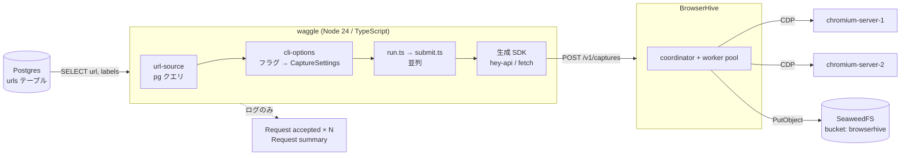

## Stage 0 — 現在の到達点

waggle の担当範囲が小さいのは意図的です。`POST /v1/captures` から右側はすべて
BrowserHive のもので、[あちらのドキュメント](https://uraitakahito.github.io/browserhive/ja/)に
書かれています。

## 投げっぱなし (fire-and-forget)

BrowserHive はリクエストをキューに載せた時点で **202** と `taskId` を返し、
キャプチャは非同期に走ります。waggle は受理されたかどうかを記録して終了します。

**ポーリングするエンドポイントはありません**。API のパスは
`POST /v1/captures` と `GET /v1/status` の 2 本だけです。タスクの結末は
BrowserHive の完了ログと成果物ストアに現れ、waggle には現れません。

知っておくべき帰結:

- `Request summary` の `accepted: 3` は 3 件が**キューに入った**という意味で、
  3 件のキャプチャが成功したという意味ではありません。
- 受理後の失敗は waggle からは見えません。ライフサイクル追跡はロードマップの
  Stage 1 です。
- `correlationId` (送信ごとに採番される 16 進 8 桁) が、waggle のログ行と
  成果物のファイル名を結ぶ糸です。

## モジュール構成

| モジュール                  | 責務                                                                          |
| --------------------------- | ----------------------------------------------------------------------------- |
| `src/cli.ts`                | エントリポイント。パースして実行し、致命的エラーで非ゼロ終了。                |
| `src/config/cli-options.ts` | フラグ定義、`ClientOptions`、リクエストボディに展開される `CaptureSettings`。 |
| `src/data/url-source.ts`    | 唯一の SQL クエリ。`{ url, labels }[]` を返す。                               |
| `src/client/run.ts`         | オーケストレーション: 読み込み → 設定 → 全件送信 → サマリ。                   |
| `src/client/submit.ts`      | 1 リクエスト。例外を投げず、失敗は `accepted: false` で返す。                 |
| `src/http/generated/`       | vendored の OpenAPI spec からの生成物。手で編集しない。                       |
| `src/db/`                   | プール、Kysely の配線、マイグレーション、seed。                               |

## エラーの扱い

HTTP の失敗 (RFC 7807 の problem レスポンス) も転送の失敗も、メッセージ付きの
`accepted: false` として返ります — `submitRequest` は呼び出し側に例外を投げません。
メッセージは `title` より `detail` を優先するので、拒否されたリクエストは
ステータスコードではなく**問題のフィールド**を報告します。

## ネットワーク構成

Compose の全サービスは `chromium-network` ブリッジを共有します。

| サービス          | ネットワーク内の名前 | コンテナポート     | ホストポート (dev) |
| ----------------- | -------------------- | ------------------ | ------------------ |
| postgres          | `postgres`           | 5432               | 5432               |
| seaweedfs         | `seaweedfs`          | 8333 / 8888 / 9333 | — (内部のみ)       |
| chromium-server-1 | `chromium-server-1`  | 9222 (CDP)         | 9222               |
| chromium-server-2 | `chromium-server-2`  | 9222 (CDP)         | 9223               |
| browserhive       | `browserhive`        | 8080               | 8080               |
| waggle            | `waggle`             | —                  | —                  |

`compose.prod.yaml` は CDP と Postgres のホストポートを外し (ワーカーと DB は
内部のみ)、`scripts/prod-smoke.sh` が順に実行する一発サービス
`waggle-migrator` と `waggle-seeder` を追加します。

バケットの作成は**独立したサービスではありません**。BrowserHive の SeaweedFS
entrypoint が `weed server` と並行して `init-bucket.sh` を起動し、そのリトライ
ループが待機を担います。`browserhive` には `WAIT_FOR_S3` を渡してあり、
entrypoint が S3 リスナーの応答を待ってからサーバを起動します。起動時の
`HeadBucket` は fatal で、`depends_on` は起動順しか保証しないためです。

## 上流のピン留め

waggle は 4 つのファイルで BrowserHive のタグを固定しています。
[BrowserHive の更新](/waggle/ja/upgrading-browserhive/)を参照してください
(そのページは現在の値をリポジトリから読んでおり、ここに再掲しません)。
