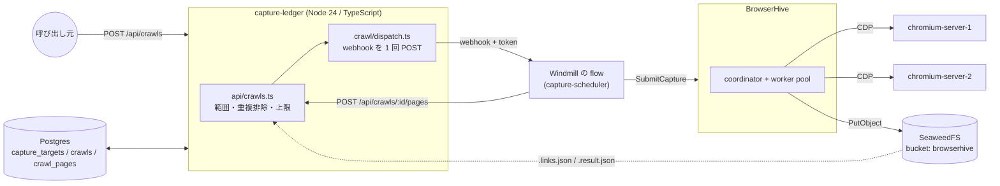
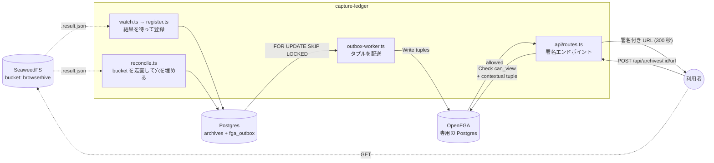

## Stage 0 — 現在の到達点

## 投げてから、結末を回収するまで

**capture-ledger はもう BrowserHive と gRPC で話しません。** 投げて待って報告するのは
Windmill の flow で、capture-ledger は次の段を組み立てて記録します。capture-ledger の設定に
BrowserHive の在り処は 1 つも入っていません。

1 段が 1 往復です。flow は渡された URL を取り込み、`POST /api/crawls/:id/pages` に
ページごとの `taskId` と状態を載せて返します。capture-ledger は `crawl_pages` を書き、
帰属を記録し、見つかったリンクを範囲で絞り、上限を当て、次の段を答えます ——
あるいは `stopReason` を返します。

段の報告に**成果物の在り処は載っていません**。そこで capture-ledger は、BrowserHive が
成果物の隣に書く `{taskId}_{correlationId}[_{labels}].result.json` を読み直します。
この file は BrowserHive の再起動にも、有界な結果キャッシュの追い出しにも耐えるので、
ここで使えます。

知っておくべき帰結:

- **`failed` と報告されたページでも、アーカイブができていることがあります。**
  flow が待っている間に結果がキャッシュから溢れると、flow は `NOT_FOUND` を
  受け取って失敗と報告しますが、manifest は bucket に在るので capture-ledger が拾い直し、
  `crawl_pages` の記録を直します。
- まだ manifest が無い `taskId` は、投げずに飛ばします。ここで投げると、書き込みが
  少し遅れただけで段の報告が 500 になり、クロールが止まります。遅れたぶんは
  reconcile が拾います。
- `capture_submissions` は `taskId` を持つ**全件**に書きます（成功したものだけでは
  ありません）。後で reconciler が要るのは、まさにこの帰属です。

## 台帳と認可

上の図は**投げるところまで**です。取り込みが終わったあと、capture-ledger は結果を台帳に
入れ、それを読んでよい相手だけに署名付き URL を配ります。ここが OpenFGA の
出番です。

読み方の要点:

- **`archives` と `fga_outbox` は 1 つのトランザクションで書かれます。**
  Postgres と OpenFGA に跨がるトランザクションが無いので、タプルは「送る予定」として
  同じ箱に入れ、`outbox-worker` が受理されるまで再送します。
- **OpenFGA は別の Postgres を持ちます。** capture-ledger のものと共用しないのは、
  タプルの書き込みがアプリのトランザクションに入れられないこと ——
  だから outbox が要ること —— を目に見えるようにするためです。
- **所属は保存しません。** 「この人はどの組織か」はトークンから来て、Check のたびに
  contextual tuple として渡されます。
- 台帳へ入る道は 2 本あります。**クロール**が段で取り込んだぶんを載せる経路
  （速い。`src/crawl/admit-level.ts`）と、`reconcile` が bucket を走査する経路
  （capture-ledger が止まっていた間の取りこぼしを拾う）。どちらも `admitArchive` を通り、
  `(bucket, object_key)` が unique なので、同じ取り込みに 2 度届いても増えません。

詳しくは[アーカイブ台帳](/capture-ledger/ja/archive-ledger/)を参照してください。

## モジュール構成

| モジュール                      | 責務                                                                                             |
| ------------------------------- | ------------------------------------------------------------------------------------------------ |
| `src/api/server.ts`             | 唯一の入口。取り込みの設定を起動時に 1 度読み、route を登録し、outbox をタイマーで掃き出す。     |
| `src/api/crawls.ts`             | クロールを起こす / 段を受ける / 次の段を返す。認可・方針・記録。                                 |
| `src/crawl/`                    | 範囲、上限、段の台帳登録、Windmill への dispatch。                                               |
| `src/config/capture-formats.ts` | `CAPTURE_LEDGER_CAPTURE_FORMATS` / `_SIGNING` を、毎回載せる `captureFormats` にする。           |
| `src/data/url-source.ts`        | 唯一の SQL クエリ。`capture_targets` から、頼んだ組織のぶんだけ `{ url }[]` を返す。             |
| `src/archive/`                  | manifest、台帳への受け入れ、reconciler。                                                         |
| `src/rpc/generated/`            | 型だけ。vendored の `.proto` からの生成物で手で編集しない（manifest が `CaptureResultReport`）。 |
| `src/db/`                       | プール、Kysely の配線、マイグレーション、seed。                                                  |

## エラーの扱い

拒否と障害の見分けは、いまや flow の仕事です —— gRPC のチャンネルを持っているのが
あちらだからです。capture-ledger の側の関心事は、`crawls` の行がどうなるかです。

投げられなかった dispatch は、その行をメッセージ付きで `failed` にして締めます。
**`running` のまま放置しません。** 部分 unique index が効いているので、締め忘れた
行は以後のクロールを永久に塞ぎますし、生きているものとの区別が行に無いからです。

API 側の予期しない失敗は、素の `500 { "error": "internal error" }` で返します。
Fastify の既定は `err.message` と `err.code` をそのまま返しますが、Postgres の
エラーはそこに列の型と値の成れの果てを載せてくるので、client 側の誤りが
**サーバ内部の形を教える窓**になります。4xx はそのまま通します —— あれは client に
向けて書かれた文言です。

## ネットワーク構成

スタックは Apple Container 上で動きます。プロジェクト名がそのまま DNS ドメインに
なるので、各サービスは `<service>.capture-ledger` です。**コンテナ間からもホストからも**
解決できるため、capture-ledger 自身はコンテナを必要としません。

| サービス       | DNS 名                       | コンテナポート     | ホストポート |
| -------------- | ---------------------------- | ------------------ | ------------ |
| postgres       | `postgres.capture-ledger`    | 5432               | 5432         |
| seaweedfs      | `seaweedfs.capture-ledger`   | 8333 / 8888 / 9333 | — (内部のみ) |
| chromium-1     | `chromium-1.capture-ledger`  | 9222 (CDP)         | 9222         |
| chromium-2     | `chromium-2.capture-ledger`  | 9222 (CDP)         | 9223         |
| browserhive    | `browserhive.capture-ledger` | 50051 (gRPC)       | 50051        |
| capture-ledger | —（ホストで動く）            | —                  | —            |

compose ファイルは 1 つです。migrate / seed の一発ジョブはサービスではなく、
`scripts/prod-smoke.sh` が `container run --rm` で起動します（container-compose に
`run` が無いため）。イメージの `ENTRYPOINT` は `node dist/api/server.js` なので、
これらのジョブはそれを上書きして走らせます。

バケットの作成は**独立したサービスではありません**。BrowserHive の SeaweedFS
entrypoint が `weed server` と並行して `init-bucket.sh` を起動し、そのリトライ
ループが待機を担います。`browserhive` には `WAIT_FOR_S3` を渡してあり、
entrypoint が S3 リスナーの応答を待ってからサーバを起動します。起動時の
`HeadBucket` は fatal で、`depends_on` は起動順しか保証しないためです。

## 上流のピン留め

capture-ledger は submodule ポインタ 1 つで BrowserHive の版を固定しています。
[BrowserHive の更新](/capture-ledger/ja/upgrading-browserhive/)を参照してください
(そのページは現在の値をリポジトリから読んでおり、ここに再掲しません)。
